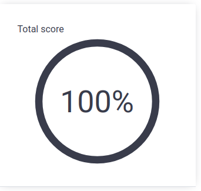

[![Contributors][contributors-shield]][contributors-url]
[![Forks][forks-shield]][forks-url]
[![Stargazers][stars-shield]][stars-url]
[![Issues][issues-shield]][issues-url]
[![MIT License][license-shield]][license-url]
[![LinkedIn][linkedin-shield]][linkedin-url]

<!-- PROJECT LOGO -->
 

  <h3 align="center">Codility-Exercises-Solutions</h3>

  

    Solutions for Codility Exercises problems written in CPP and Python.
     
     Note that most of the solutions differ from each other not only by the language, but by the algorithm as well.
     
    All of the solutions were submitted and scored 100.
     
    .
    <a href="https://github.com/RosenbergYehuda/Codility-Exercises-Solutions"><strong>Explore the docs »</strong></a>
     
    ·
    <a href="https://github.com/RosenbergYehuda/Codility-Exercises-Solutions">Report Bug</a>
    ·
    <a href="https://github.com/RosenbergYehuda/Codility-Exercises-Solutions/issues">Request Feature</a>
  

<!-- TABLE OF CONTENTS -->

  
Table of Contents

  <ol>
    <li>
      <a href="#algorithmic-skills">Algorithmic skills</a>
      <ul>
      </ul>
    </li>
    </li>
     <li><a href="#bitwise-operations">Bitwise operations </a></li>
      </ul>
    </li>
    <li><a href="#coding-skills">Coding skills</a></li>
    <li><a href="#data-structures">Data Structures</a></li>
    <li><a href="#contributing">Contributing</a></li>
    <li><a href="#license">License</a></li>
    <li><a href="#contact">Contact</a></li>
  </ol>

<!-- Algorithmic skills -->
## Algorithmic skills

- <a href="https://github.com/RosenbergYehuda/Codility-Exercises-Solutions/blob/main/Algorithmic%20skills/firstUnique.cpp">firstUnique.cpp</a>

- <a href="https://github.com/RosenbergYehuda/Codility-Exercises-Solutions/blob/main/Algorithmic%20skills/first_unique.py">first_unique.py</a>

- <a href="https://github.com/RosenbergYehuda/Codility-Exercises-Solutions/blob/main/Algorithmic%20skills/strSymmetryPoint.cpp">strSymmetryPoint.cpp</a>

- <a href="https://github.com/RosenbergYehuda/Codility-Exercises-Solutions/blob/main/Algorithmic%20skills/str_symmetry_point.py">str_symmetry_point.py</a>

- <a href="https://github.com/RosenbergYehuda/Codility-Exercises-Solutions/blob/main/Algorithmic%20skills/treeHeight.cpp">treeHeight</a>

- <a href="https://github.com/RosenbergYehuda/Codility-Exercises-Solutions/blob/main/Algorithmic%20skills/tree_height.py">tree_height.py</a>

(<a href="#top">back to top</a>)

<!-- Bitwise operations (bit-ops) -->
## Bitwise operations

- <a href="https://github.com/RosenbergYehuda/Codility-Exercises-Solutions/blob/main/Bitwise%20operations%20(bit-ops)/binaryGap.cpp">binaryGap.cpp</a>

- <a href="https://github.com/RosenbergYehuda/Codility-Exercises-Solutions/blob/main/Bitwise%20operations%20(bit-ops)/binary_gap.py">binary_gap.py</a>

(<a href="#top">back to top</a>)

<!-- Coding skills -->
## Coding skills 

- <a href="https://github.com/RosenbergYehuda/Codility-Exercises-Solutions/blob/main/Coding%20skills/parityDegree.cpp">parityDegree</a>

- <a href="https://github.com/RosenbergYehuda/Codility-Exercises-Solutions/blob/main/Coding%20skills/parity_degree.py">parity_degree</a>

- <a href="https://github.com/RosenbergYehuda/Codility-Exercises-Solutions/blob/main/Coding%20skills/parkBill.cpp">parkBill.cpp</a>

- <a href="https://github.com/RosenbergYehuda/Codility-Exercises-Solutions/blob/main/Coding%20skills/park_bill.py">park_bill.py</a>

(<a href="#top">back to top</a>)

<!-- Data Structures -->
## Data Structures

- <a href="https://github.com/RosenbergYehuda/Codility-Exercises-Solutions/blob/main/Data%20Structures/arrListLen.cpp">arrListLen</a>

(<a href="#top">back to top</a>)

<!-- CONTRIBUTING -->
## Contributing

Yehuda Z Rosenberg

(<a href="#top">back to top</a>)

<!-- LICENSE -->
## License

Distributed under the MIT License. See `LICENSE` for more information.

(<a href="#top">back to top</a>)

<!-- CONTACT -->
## Contact

Yehuda Rosenberg

yehudazevr@gmail.com

Project Link: https://github.com/RosenbergYehuda/Codility-Exercises-Solutions

(<a href="#top">back to top</a>)

<!-- MARKDOWN LINKS & IMAGES -->
<!-- https://www.markdownguide.org/basic-syntax/#reference-style-links -->
[contributors-shield]: https://img.shields.io/github/contributors/RosenbergYehuda/Codility-Exercises-Solutions.svg?style=for-the-badge
[contributors-url]: https://github.com/RosenbergYehuda/Codility-Exercises-Solutions/graphs/contributors
[forks-shield]: https://img.shields.io/github/forks/RosenbergYehuda/Codility-Exercises-Solutions.svg?style=for-the-badge
[forks-url]: https://github.com/RosenbergYehuda/Codility-Exercises-Solutions/network/members
[stars-shield]: https://img.shields.io/github/stars/RosenbergYehuda/Codility-Exercises-Solutions.svg?style=for-the-badge
[stars-url]: https://github.com/RosenbergYehuda/Codility-Exercises-Solutions/stargazers
[issues-shield]: https://img.shields.io/github/issues/RosenbergYehuda/Codility-Exercises-Solutions.svg?style=for-the-badge
[issues-url]: https://github.com/RosenbergYehuda/Codility-Exercises-Solutions/issues
[license-shield]: https://img.shields.io/github/license/RosenbergYehuda/Codility-Exercises-Solutions.svg?style=for-the-badge
[license-url]: https://github.com/RosenbergYehuda/Codility-Exercises-Solutions/blob/master/LICENSE
[linkedin-shield]: https://img.shields.io/badge/-LinkedIn-black.svg?style=for-the-badge&logo=linkedin&colorB=555
[linkedin-url]: https://linkedin.com/in/yehuda-rosenberg-38835243 
